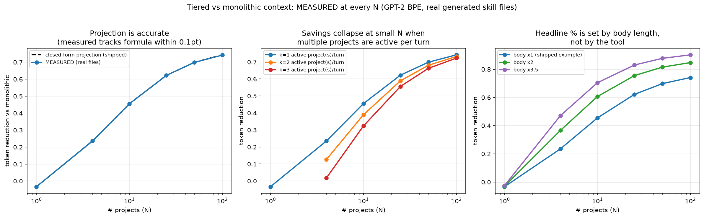

# Measured Benchmark: Empirical Check of the Token-Reduction Projection

> The shipped `benchmark.py` directly measures N=4 on the author's `~/.kiro` deployment and
> PROJECTS N=10/25/50/100 with a closed-form formula. This document reports what happens when
> you instead BUILD real skill files at every N from the shipped template and measure them.
> Everything below is measured; nothing is extrapolated.
> Reproduce: `python benchmark/benchmark_measured.py && python benchmark/plot_measured.py`
> (run from the repo root; needs `transformers` and `matplotlib`).

Inputs (all from the shipped repo contents, GPT-2 BPE): always-on tier = 1,150 tokens across the
5 steering templates; shipped example skill = 221 tokens, of which 46 are frontmatter (metadata).
Generated skill files change only the `name:` line, so metadata size matches the shipped template.

## 1. The projection holds
Measured reduction matches the closed-form formula within **0.1 percentage points** at every N:

| N | projected | measured | delta |
|---|---|---|---|
| 1 | −0.034 | −0.034 | 0.000 |
| 4 | 0.235 | 0.235 | 0.000 |
| 10 | 0.455 | 0.455 | 0.000 |
| 25 | 0.622 | 0.622 | 0.000 |
| 50 | 0.699 | 0.699 | 0.000 |
| 100 | 0.743 | 0.742 | −0.001 |

The formula `1 − (always_on + meta·N + body) / (always_on + body·N)` is exact up to tokenizer noise
on the `name:` line. The README's larger-N rows are a valid extrapolation of whatever per-project sizes
are fed in.

## 2. What the shipped benchmark does not report

### 2a. Break-even: N=1 is a net loss (−3.4%)
With a single project, tiered context costs *more* than monolithic: you pay metadata + body instead of
body alone. Tiering pays off from N≥2. This is the same −3.4% you get by running the shipped
`benchmark.py` against the shipped templates (which contain exactly one example skill).

### 2b. Multiple active projects per turn shrink small-N savings
The shipped table assumes exactly **one** project body is active per turn. Multi-project work (the
tool's stated use case: cross-links between projects) loads several:

| N | k=1 active | k=2 active | k=3 active |
|---|---|---|---|
| 4 | 23.5% | 12.7% | **1.8%** |
| 10 | 45.5% | 38.9% | 32.4% |
| 25 | 62.2% | 58.9% | 55.6% |
| 100 | 74.2% | 73.2% | 72.3% |

At N=4, a 3-project turn almost eliminates the saving (23.5% → 1.8%). The benefit is robust only at
large N, where the metadata of the inactive projects dominates either way.

### 2c. The headline percentage is set by the metadata/body ratio
The asymptote as N→∞ is `1 − meta/body`. Holding frontmatter fixed at 46 tokens and scaling the body
text (a sensitivity sweep, not an emulation of any particular deployment):

| N | body ×1 (shipped, 221 tok) | ×2 (395 tok) | ×3.5 (652 tok) |
|---|---|---|---|
| 4 | 23.5% | 36.7% | 47.1% |
| 100 | 74.2% | 84.8% | 90.3% |
| asymptote | **79.2%** | 88.3% | 92.9% |

The README's 90.6% asymptote came from the author's deployment (mean body 774, mean meta 73). From the
shipped template alone the asymptote is 79.2%. Both are correct for their inputs; the number a user
sees depends on how long their skill files are relative to their frontmatter.

## 3. Reproducibility of the committed numbers
`benchmark/results.json` (24.5% at N=4, 90.6% asymptote) was produced from a `~/.kiro` deployment that
is not part of the repo, so those specific figures can't be regenerated from a clone.
`benchmark_measured.py` generates its own skill files from the shipped template, so every number in
this document is reproducible from repository contents.

## 4. What is not measured (unchanged from the original)
- **Token cost only, not task quality.** Nothing here checks whether an agent answers correctly with
  the unloaded projects absent. That is the SWE-bench study in `research/` (see `research/STATUS.md`).
- **Tokenizer:** GPT-2 BPE. Kiro's `/context` uses a model-approximate counter; absolute numbers will
  differ, ratios should not.
- **Skill body persistence:** whether an invoked `skill://` body stays in context on later turns is not
  documented; k=1 per turn is an optimistic lower bound on tiered cost.

## Suggested README wording
Keep the projection (it holds), and qualify the headline: *"~24% at 4 projects rising to ~75–90% at
100, assuming one active project per turn. Multi-project turns and single-project setups reduce or
eliminate the saving; the ceiling is set by your metadata-to-body ratio."*
