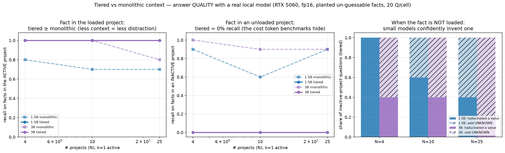

# Quality Benchmark: Does Tiered Context Preserve Answer Correctness?

> The shipped `benchmark.py` and `benchmark_measured.py` measure **token cost only**. Neither checks
> whether an agent still answers correctly when project bodies are left unloaded. This benchmark
> measures that with a real local model on GPU. Reproduce: `benchmark/quality_benchmark.py` →
> `plot_quality.py`. All numbers measured; nothing projected.

## Method
- **N synthetic projects** (4 / 10 / 25), each a real SKILL.md-style file with 5 **planted facts**
  whose values are random strings (e.g. `dw-5104`). The model cannot know them from pretraining, so
  a correct answer proves the fact was *read from the prompt*.
- **Two conditions**, identical always-on steering in both:
  - **Monolithic** = always-on + all N project bodies
  - **Tiered** = always-on + all N metadata blocks + only the k active bodies (k = 1, 2)
- **Two question types**: fact in an **active** (loaded) project vs an **inactive** (unloaded) one.
  20 questions per cell, half each. Greedy decoding, normalized substring match.
- **Models**: Qwen2.5-1.5B and 3B Instruct, fp16, local/offline, RTX 5060.

## Finding 1 — When the fact IS loaded, tiered matches or beats monolithic
Recall on facts in the active project (k=1):

| N | 1.5B mono | 1.5B tiered | 3B mono | 3B tiered |
|---|---|---|---|---|
| 4 | 0.80 | **1.00** | 1.00 | **1.00** |
| 10 | 0.70 | **1.00** | 1.00 | **1.00** |
| 25 | 0.70 | **1.00** | 0.80 | **1.00** |

Tiered scores **100% in every cell**. Monolithic *degrades* as N grows: the 3B drops to 0.80 at N=25,
the 1.5B to 0.70. Loading everything is not free even when the answer is present — the extra
context is a **distractor**. This is a quality argument *for* tiering that the token benchmarks
cannot make.

## Finding 2 — When the fact is NOT loaded, tiered recall is exactly 0%
Recall on facts in an inactive project (k=1):

| N | 1.5B mono | 1.5B tiered | 3B mono | 3B tiered |
|---|---|---|---|---|
| 4 | 0.90 | **0.00** | 1.00 | **0.00** |
| 10 | 0.60 | **0.00** | 0.90 | **0.00** |
| 25 | 0.90 | **0.00** | 0.90 | **0.00** |

This is the cost tiering carries and that no token count shows: **any question whose answer lives
in an unloaded project is unanswerable.** Monolithic recovers 60–100% of these. The tool's
selling point — cross-project work — is exactly the case where tiering fails, unless the registry
marks the right projects active *before* the question is asked. (k=2 gives the same pattern.)

## Finding 3 — Small models hallucinate the missing value instead of saying UNKNOWN
The system prompt instructed: *"If the value is not in the context, reply UNKNOWN."* When the fact
was unloaded under tiering:

| N | 1.5B said UNKNOWN | 1.5B **invented a value** | 3B said UNKNOWN | 3B **invented a value** |
|---|---|---|---|---|
| 4 | 0/10 | **10/10** | 6/10 | 4/10 |
| 10 | 4/10 | **6/10** | 6/10 | 4/10 |
| 25 | 6/10 | **4/10** | 8/10 | 2/10 |

The 1.5B fabricated a plausible-looking value (e.g. `ek-3289` for gold `wx-4350`) **100% of the
time at N=4**. The 3B is better but still invents 20–40%. Tiering does not just lose the answer —
with a weak model it **silently substitutes a wrong one**. This is the most consequential finding:
a token benchmark shows "saved 58%"; the user sees a confident wrong build tag.

Two mitigations the data suggests: (a) the failure shrinks with model size, so tiering is safer with
stronger models; (b) the UNKNOWN rate rises with N, likely because more metadata blocks make the
"this project exists but isn't loaded" situation more legible to the model.

## Token cost at the same cells (for reference — matches the cost benchmarks)
| N | k | mono tok | tiered tok | reduction |
|---|---|---|---|---|
| 4 | 1 | 2,098 | 1,389 | 34% |
| 10 | 1 | 3,775 | 1,580 | 58% |
| 25 | 1 | 7,980 | 2,061 | 74% |

## What this changes about the repo's claim
The cost benchmarks say "tiered saves 25–90% of tokens." This benchmark adds the other axis:

- **In-scope questions:** tiered is *better* (100% vs 70–100%) — fewer distractors.
- **Out-of-scope questions:** tiered is *catastrophic* (0%), and small models fabricate.

So the honest statement is: *tiering is a large win **if the registry correctly predicts which
projects a turn needs**, and a silent correctness failure when it doesn't.* The registry's
accuracy, not the token ratio, is the variable that decides whether tiering helps or hurts.

## Honest scope
- **Simulated tiering.** Prompts are constructed to mirror always-on/metadata/body loading; this
  does not exercise Kiro's actual `skill://` loader or its on-demand invocation.
- **Small models.** ≤3B has weaker long-context recall than the frontier models Kiro users run.
  Absolute recall is pessimistic; the *relative* tiered-vs-monolithic gap and the 0% floor are the
  reliable signals. Hallucination rates will be lower with stronger models, not zero.
- **n=10 per question type per cell.** Directional, not tight CIs.
- **Synthetic facts.** Real project context has redundancy and cross-references that may let a
  model infer unloaded facts; random strings remove that, giving a clean lower bound.
- **Hardware metrics** (prefill ms, VRAM) are recorded in `results_quality_*.json` under
  `hardware_personal` for the machine owner. They are single-laptop-GPU numbers and are
  deliberately excluded from these findings.
